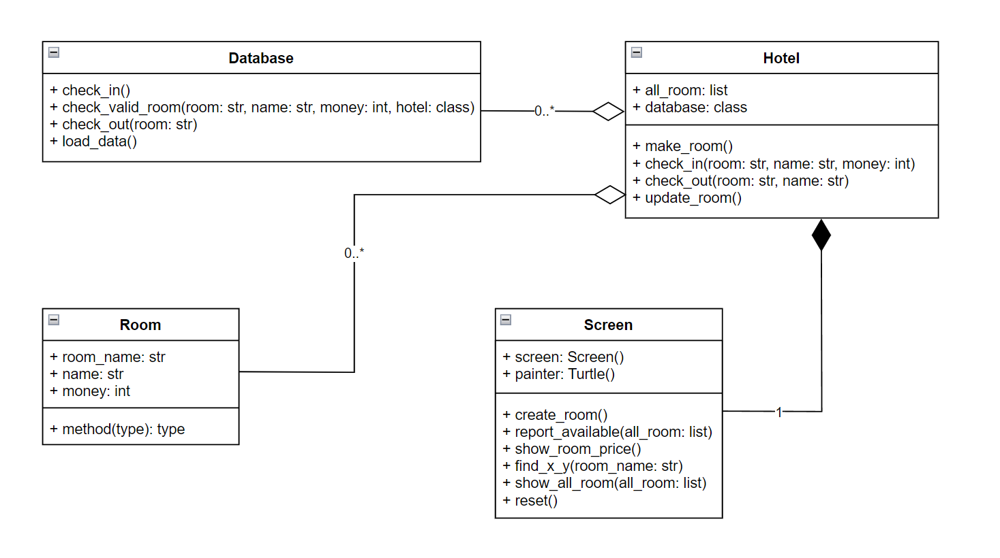

# Hotel (Room Reservation)
This program is a part of the 01219114 Computer Programming 1 course. It's about room reservation. You can choose any room you want.

## Overview and features
The main program will ask user that you want to check in or check out, Then it 
will show you all room (including the room that reserved) in the hotel on the graphic.

**The program contain with 3 menus.**
* Check in feature.
* Check out feature.
* Quit program.

## The program's requirement
* [turtle](https://docs.python.org/3/library/turtle.html), which is used for the graphical part.
* [rich](https://pypi.org/project/rich/), which is used for decoration.

## About design
* `Database` : This class used for read and write file contain with room, name and money.
* `Hotel` : This class used for create room, check in and check out.
* `Room` : This class used for represent room and name.
* `Screen` : This class used for create all graphical output in this program will show available, reserved room and room's price in each floor.

And here is class diagram of the program.

## Code structure
This program consists of five python files and another one csv file for collect data.
* [database.py](database.py) : This file contains the `Database` class.
* [hotel.py](hotel.py) : This file contains the `Hotel` class.
* [room.py](room.py) : This file contains the `Room` class.
* [screen.py](screen.py) : This file contains the `Screen` class.
* [main.py](main.py) : This file used to run main program 
